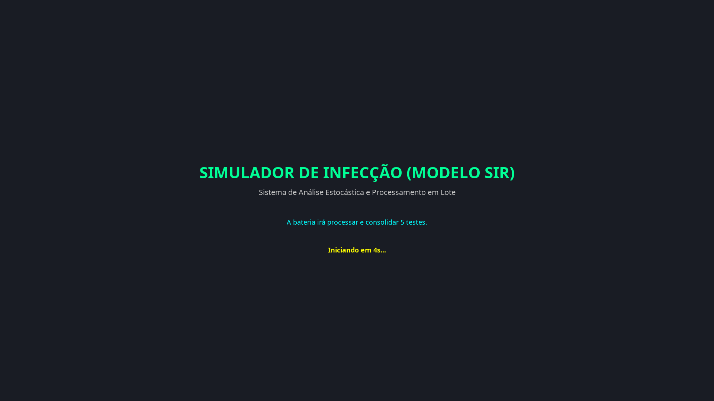
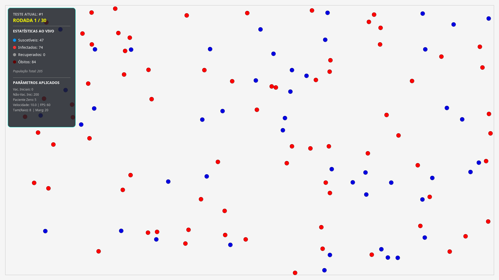
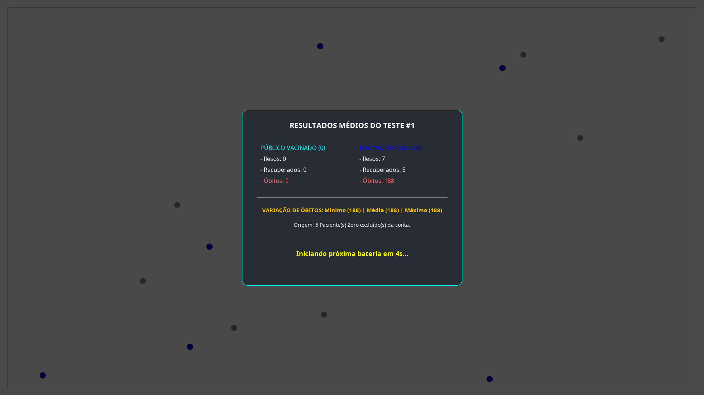
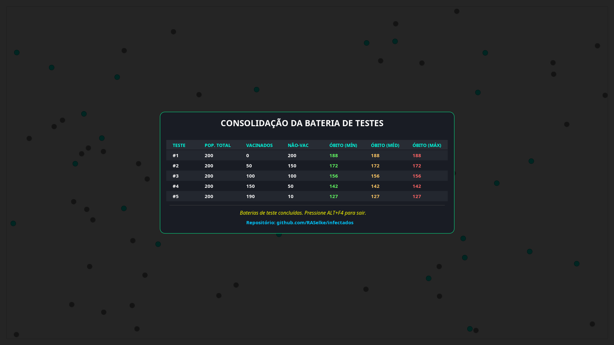
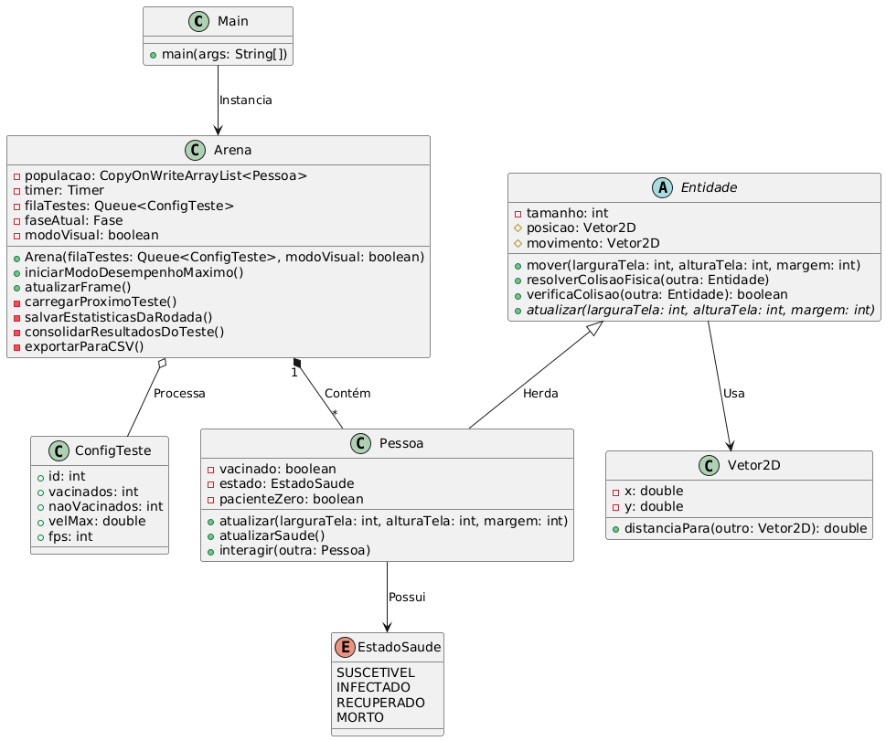

# 🦠 Simulador de Infecção (Modelo SIR)

## 📖 Sobre o Projeto
Este projeto é uma simulação computacional baseada no **Modelo Epidemiológico SIR** (Suscetíveis, Infectados, Recuperados e Mortos). O escopo desta aplicação evoluiu de uma simulação básica para uma modelagem epidemiológica complexa, compondo o trabalho prático da disciplina de **Programação Orientada a Objetos II** no curso de Bacharelado em Ciência da Computação. O foco principal é a aplicação de conceitos avançados de engenharia e arquitetura de software em um cenário de experimentação estatística.

A ferramenta opera como um analisador de dados estocástico (**Método de Monte Carlo**). O sistema executa baterias de testes em lote (*Batch Processing*) a partir de um arquivo importado para analisar a propagação de um vírus sob diferentes variáveis, extraindo os cenários de **Mínimo, Média e Máximo** de óbitos.

---

## ▶️ Apresentação em Vídeo

Confira a demonstração completa do simulador, incluindo a explicação da arquitetura de software e a comprovação estatística da Imunidade de Rebanho através da execução em lote:

*(Clique na imagem acima para assistir ao vídeo no YouTube)*

---

## 📸 Demonstração Visual

*(Abaixo estão as telas do simulador operando no Modo de Apresentação)*

  
  

  
  

---

## ⚙️ Funcionalidades e Destaques Técnicos

O simulador conta com um ecossistema robusto e blindado contra falhas de concorrência (*Race Conditions*), operando de forma autônoma:

* **Motor de Física 2D:** Entidades dinâmicas com cálculo de vetores para movimentação e sistema de colisão elástica avançada (conservação de momento e correção de sobreposição).
* **Biologia e Probabilidade:** * População dividida entre **Vacinados** e **Não Vacinados**, afetando a probabilidade de infecção e letalidade.
  * Implementação de um **Paciente Zero** blindado para não adulterar os cálculos de eficácia final da vacina.
* **Multithreading e Modos de Execução:** Uma *State Machine* (Máquina de Estados) gerencia o fluxo em dois modos, selecionáveis via menu interativo (`JOptionPane`) ao iniciar:
  * **Modo de Apresentação (Visual):** Processamento com limite de FPS, *Splash Screen* de introdução, HUD de métricas ao vivo, transições cinematográficas (*Fade In/Fade Out*) e renderização em tabela.
  * **Modo de Desempenho (Headless):** Renderização gráfica desligada e FPS destravado. Permite executar milhares de testes em milissegundos utilizando 100% da CPU. O tráfego de dados é protegido por coleções nativas à prova de concorrência (`CopyOnWriteArrayList`).
* **Persistência de Dados (I/O):** Leitura de configurações flexíveis no `testes.csv` e consolidação de resultados formatados automaticamente no arquivo `resultados_saida.csv`.

---

## 🗺️ Arquitetura do Sistema (Diagrama de Classes)

O diagrama abaixo ilustra a estrutura Orientada a Objetos do simulador, demonstrando a aplicação de Herança, Composição e Polimorfismo.

  

---
    
## 🛠️ Como Executar o Projeto

1. Certifique-se de ter o Java (JDK) instalado na sua máquina.
2. Clone este repositório: git clone https://github.com/RASelke/infectados.git
3. Edite o arquivo testes.csv na raiz do projeto para criar ou alterar os cenários que deseja simular.
4. Execute a classe Main.java localizada dentro da pasta src.
5. Uma janela perguntará se você deseja executar com Visualização Gráfica ou no Modo de Alto Desempenho.
6. Ao final da execução da bateria de testes, os dados estatísticos detalhados estarão salvos e prontos para uso científico no arquivo resultados_saida.csv.